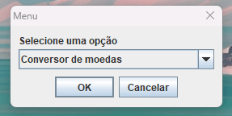

# Desafio - Conversor de medidas

Este projeto faz parte do curso da Oracle ONE, ministrado pela Alura. 🤘 #challengeoneconversorbr5

Foi desenvolvido um conversor de moedas e um conversor de temperaturas, ambos desenvolvidos em `Java`, utilizando `java.swing` para criar uma interface onde o usuário pode converter valores entre diferentes moedas ou temperaturas de forma simples.

 

    

## Funcionalidades

- Conversão de valores entre as seguintes moedas:
  - Real (BRL)
  - Dólar (USD)
  - Euro (EUR)
  - Libras Esterlinas (GBP)
  - Peso Argentino (ARS)
  - Peso Chileno (CLP)
- Conversão de valores entre as seguintes temperaturas:
  - Celsius (°C)
  - Fahrenheit (°F)
  - Kelvin (K)

## Requisitos para executar o código

- Java 8 ou superior
- Biblioteca Swing

# Como executar

- Clone o repositório;
- Abra o projeto em sua IDE Java;
- Execute a classe **Main** para iniciar a aplicação;
- Uma interface gráfica será exibida, permitindo que você selecione o tipo de conversão desejada e insira o valor a ser convertido.
- O resultado da conversão será exibido na interface.
