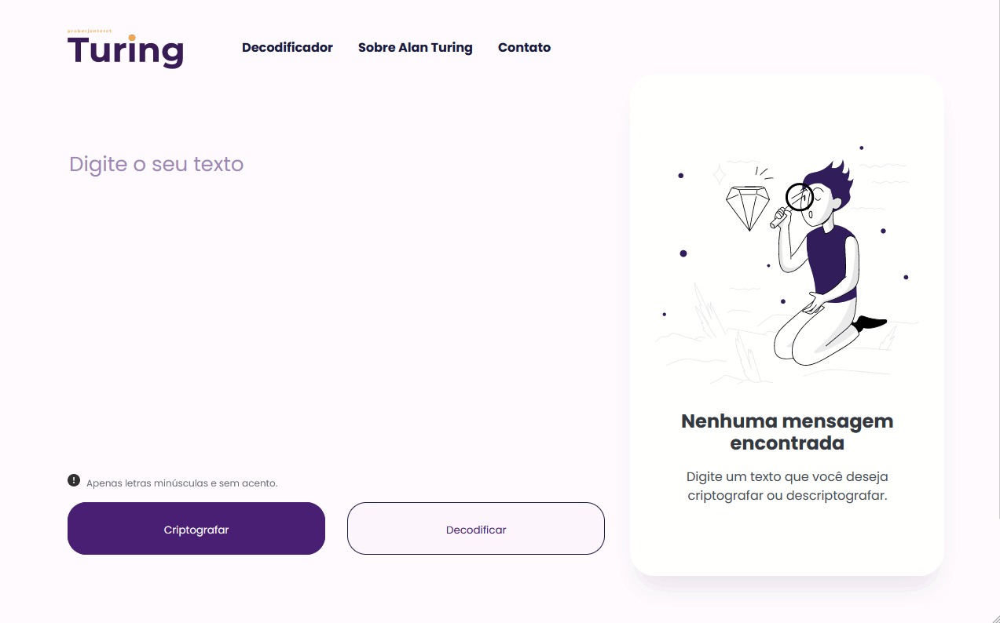

# Challenge - Text Decoder

This project is part of the Oracle ONE course, provided by Alura. 🤘 #challengeonedecodificador5

The project consists of a website that allows the user to encrypt and decrypt messages. Encryption is done using an algorithm that replaces vowels with other sets of letters, which can be called keys, meaning **for each vowel, there is a key**. Decryption is performed using the same key used in encryption.

### Preview

To use the website, just [click here](https://oihenrique.github.io/Decodificador-de-texto/).

## How to Use

In the text box, type the phrase or word you want to encrypt. Below, there are two buttons, one for encrypting the text and another for decrypting.

Note that you can also add an encrypted word in the text field and click "decrypt."

In both cases, the result of encryption or decryption appears on the right side of the screen (in the desktop version) or below the buttons (in the mobile version).

Furthermore, you can copy the output text by clicking the "copy" button.

## Usage Examples

Entered word -> gato 
Encrypted output -> gaitober

